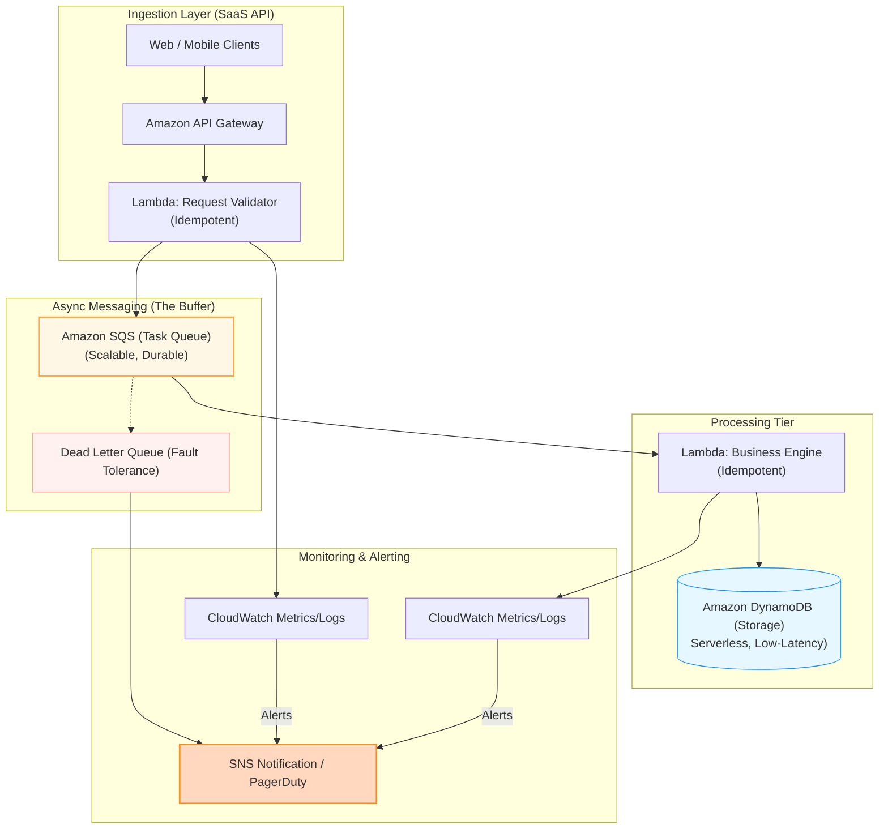

# Project 3: Scalable Event-Driven Ingestion & Processing Pipeline

## 1. Overview: The SaaS Evolution
This project demonstrates the transformation of a traditional "Single-Tenant" synchronous system into a modern, **Multi-Tenant SaaS architecture**. 

In the previous model (Project 1), each client had a dedicated stack with predictable traffic. This project tackles the challenges of **unpredictable bursts** and **distributed consistency** by migrating to an asynchronous, Event-Driven Architecture (EDA).

---

## 2. Architecture Diagram

