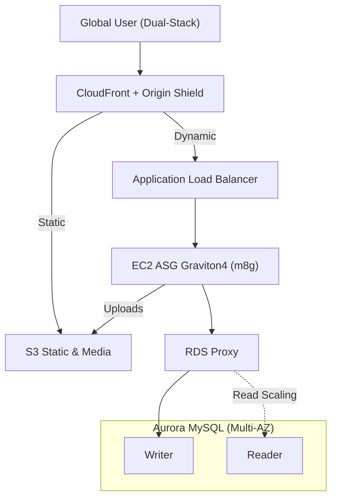
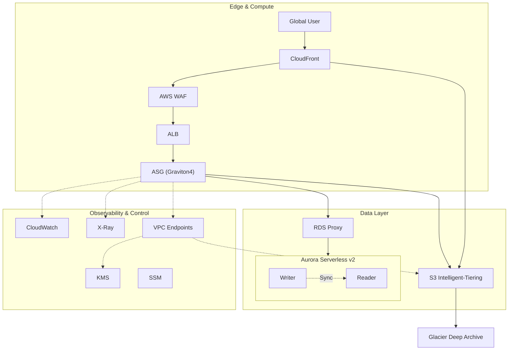

# Project 1: LAMP Stack Modernization & Cloud-Native Evolution

## 🌟 Executive Summary
This project demonstrates the modernization of a legacy **LAMP (Linux, Apache, MySQL, PHP)** monolith into a **2026-ready AWS cloud-native architecture**.

This is not a lift-and-shift exercise. The design emphasizes:
- **IPv6-first cost governance**
- **Zero-trust & private connectivity**
- **Stateless compute with managed data tiers**
- **Architect-level trade-off reasoning (SAP-C02 & ANS-C01 aligned)**

---

## 🏗️ Architecture Evolution

### 1️⃣ Core Business Path — L1 (Revenue Flow)

---

### 2️⃣ Production-Grade Details — L2/L3 (Enterprise Deep Dive)

---

## 🔁 Cache & Data Consistency Strategy (Critical Design)

### Cache Pattern Used
- **Redis follows Cache-Aside pattern**
- Aurora MySQL is the **only source of truth**
- Redis and CloudFront are **performance optimizations, not consistency authorities**

### Failure Scenario: DB Commit Succeeds, App Crashes Before Cache Delete
This architecture explicitly accepts a small inconsistency window and mitigates it via:
- Short Redis TTLs
- CloudFront dynamic-path cache bypass
- Read-repair on subsequent requests

This trade-off is **industry-accepted** for non-financial workloads.

### Stronger Guarantees (Critical Business Paths)
For highly critical data:
- **Transactional Outbox Pattern**
- Cache invalidation decoupled from application lifecycle
- Binlog/CDC-driven Lambda invalidates Redis asynchronously

This achieves **deterministic eventual consistency (>99.999%)** without tight coupling.

### Versioned Keys (Logical Invalidation)
- Redis keys include logical version numbers
- Writers bump version; readers always fetch latest
- Reduces delete storms and Redis CPU spikes

**Operational Requirements**
- Redis eviction: `allkeys-lru`
- Mandatory TTLs on all keys

### CloudFront Strong-Consistency Paths
- Sensitive paths use `CachingDisabled`
- Origin Request Policy forwards all headers, cookies, and query strings
- Application layer owns session correctness

---

## 💎 Technical Pillars

### Advanced Networking (ANS-C01)
- IPv6-only subnets
- Egress-only Internet Gateway
- VPC Endpoints for S3 & KMS

### Compute & Cost Governance
- Graviton4 (m8g): ~40% better price-performance
- Stateless ASG for aggressive scaling

### Data Resilience (SAP-C02)
- RDS Proxy absorbs PHP connection storms
- Aurora Serverless v2 elastic scaling
- S3 Intelligent-Tiering lifecycle automation

---

## 📊 Architecture Decision Records (ADR)

| Area | Decision | Reasoning |
|---|---|---|
| Compute | Graviton4 ASG | Best PHP price-performance |
| Database | Aurora Serverless v2 | Bursty traffic handling |
| Cache | Redis Cache-Aside | Simplicity & control |
| Security | WAF + PrivateLink | Zero-trust |
| Ops | SSM (No SSH) | Audit & security |
| Storage | S3 + CloudFront | Stateless design |

---

## 🚀 Future Roadmap
- Infrastructure as Code (Terraform/CDK)
- Deep X-Ray subsegment tracing
- EKS on Fargate migration path
- Aurora Global Database
