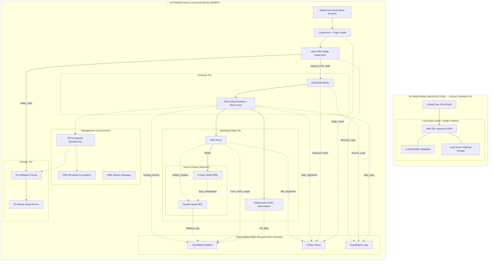

# Project 1: LAMP Stack Modernization & Cloud-Native Evolution

## 🌟 Executive Summary

This project demonstrates how a legacy **LAMP (Linux, Apache, MySQL, PHP)** monolith evolves from an on-premises server to a production-grade AWS cloud-native architecture (2026-ready).

Focus areas:

* **IPv6-first cost governance**
* **Zero-trust & Private connectivity**
* **Stateless compute** and managed serverless data tiers

---

## 🏗️ Architecture Evolution

### 1️⃣ Overview

This diagram shows the evolution from a single on-prem instance to a scalable, observable AWS-native architecture.

---

## 💎 Technical Pillars

1. **Advanced Networking**

   * IPv6-first subnets: Avoid NAT Gateway costs, deterministic latency.
   * PrivateLink (VPC Endpoints): Traffic to S3/KMS never leaves AWS backbone.

2. **Compute & Cost Governance**

   * Graviton4 (m8g): ~40% better price-performance for PHP-FPM.
   * Stateless Tiering: Offload mutable state to S3/Aurora, scale aggressively.

3. **Data Resilience**

   * RDS Proxy: Absorb PHP connection storms, seamless failover.
   * Aurora Serverless v2: Elastic scaling 0.5–128 ACUs, High Availability.
   * S3 Intelligent-Tiering: Lifecycle moves aged media to Glacier.

---

## 📊 Architecture Decision Records (ADR)

| Area     | Decision             | Reasoning                          |
| -------- | -------------------- | ---------------------------------- |
| Compute  | EC2 Graviton4 ASG    | Optimized for PHP JIT; lower TCO   |
| Database | Aurora Serverless v2 | Burst traffic; sub-minute failover |
| Security | WAF + PrivateLink    | Edge-layer filtering + Zero-Trust  |
| Ops      | SSM (No SSH)         | No Bastion, IAM-tracked access     |
| Storage  | S3 + CloudFront      | Stateless compute tier             |

---

## 🚀 Future Roadmap

* [ ] Infrastructure as Code: Terraform/CDK.
* [ ] Observability: Deep PHP tracing via X-Ray.
* [ ] Containerization: Migrate to EKS/Fargate.
* [ ] Global Scale: Aurora Global Database for sub-second cross-region DR.

