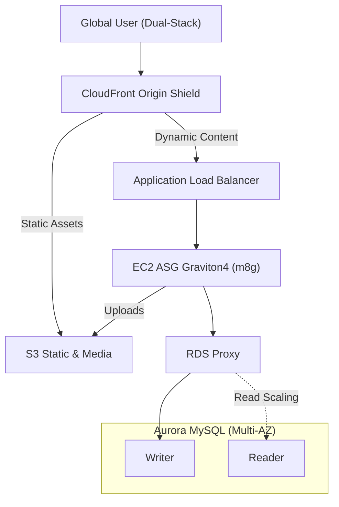
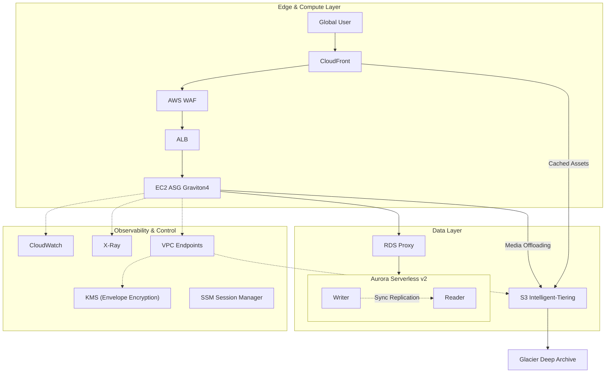

# Project 1: LAMP Stack Modernization & Cloud-Native Evolution

## 🌟 Executive Summary

This project demonstrates the modernization of a legacy **LAMP (Linux, Apache, MySQL, PHP)** monolith from an on-premises data center into a production-grade AWS cloud-native architecture (2026-ready).

This is not a lift-and-shift exercise. The focus is on:

* **IPv6-first cost governance** (Eliminating IPv4 address tax)
* **Zero-trust & Private connectivity** (AWS PrivateLink & WAF)
* **Stateless compute** (Graviton4) and managed serverless data tiers

---

## 🏗️ Architecture Evolution

### 1️⃣ Core Business Path — L1 (The Revenue Flow)

This view highlights the revenue-critical request path. All operational and governance layers are hidden to focus on high-speed content delivery and data persistence.

🛡️ **Production-Grade Details (L2/L3 Enterprise Deep Dive)**

<b>Click to Expand: Enterprise Security & Observability Layer</b>

This diagram exposes the non-obvious enterprise layers required for production readiness: private connectivity, encryption boundaries, and request-path observability.

---

## 💎 Technical Pillars (Architectural Reasoning)

### 1️⃣ Advanced Networking 

* IPv6-First Subnets: Eliminates NAT Gateway dependency and avoids the rising costs of Public IPv4 addresses.
* PrivateLink (VPC Endpoints): S3 and KMS traffic never leaves the AWS backbone, ensuring deterministic latency and a hard security boundary.

### 2️⃣ Compute & Cost Governance

* Graviton4 (m8g): Achieves ~40% better price-performance for PHP-FPM workloads compared to x86 equivalents.
* Stateless Tiering: All mutable state is offloaded to S3 or Aurora, allowing the ASG to scale aggressively and instances to be recycled without data loss.

### 3️⃣ Data Resilience 

* RDS Proxy: Absorbs connection "storms" typical of PHP applications and enables seamless failover by reducing recovery time by up to 60%.
* Aurora Serverless v2: Provides elastic scaling (0.5 to 128 ACUs) to match unpredictable traffic while maintaining High Availability.
* S3 Intelligent-Tiering: Automatic lifecycle management to move aged media to cheaper storage tiers (Glacier) without application changes.

---

## 📊 Architecture Decision Records (ADR)

| Area     | Decision             | Reasoning                                                               |
| -------- | -------------------- | ----------------------------------------------------------------------- |
| Compute  | EC2 Graviton4 ASG    | Optimized for PHP JIT performance; significantly lower TCO than R7i     |
| Database | Aurora Serverless v2 | Handles bursty traffic; sub-minute failover via RDS Proxy               |
| Security | WAF + PrivateLink    | Edge-layer filtering combined with Zero-Trust internal connectivity     |
| Ops      | SSM (No SSH)         | Eliminates Bastion Hosts; audit-trailed access via IAM                  |
| Storage  | S3 + CloudFront      | Decoupling static assets from the compute layer to enable stateless EC2 |

---

## 🚀 Future Roadmap

* [ ] Infrastructure as Code: Full deployment via Terraform/CDK.
* [ ] Observability: Implementing deep PHP tracing with X-Ray subsegments.
* [ ] Containerization: Migration path to EKS on Fargate for microservices.
* [ ] Global Scale: Implementation of Aurora Global Database for sub-second cross-region DR.
