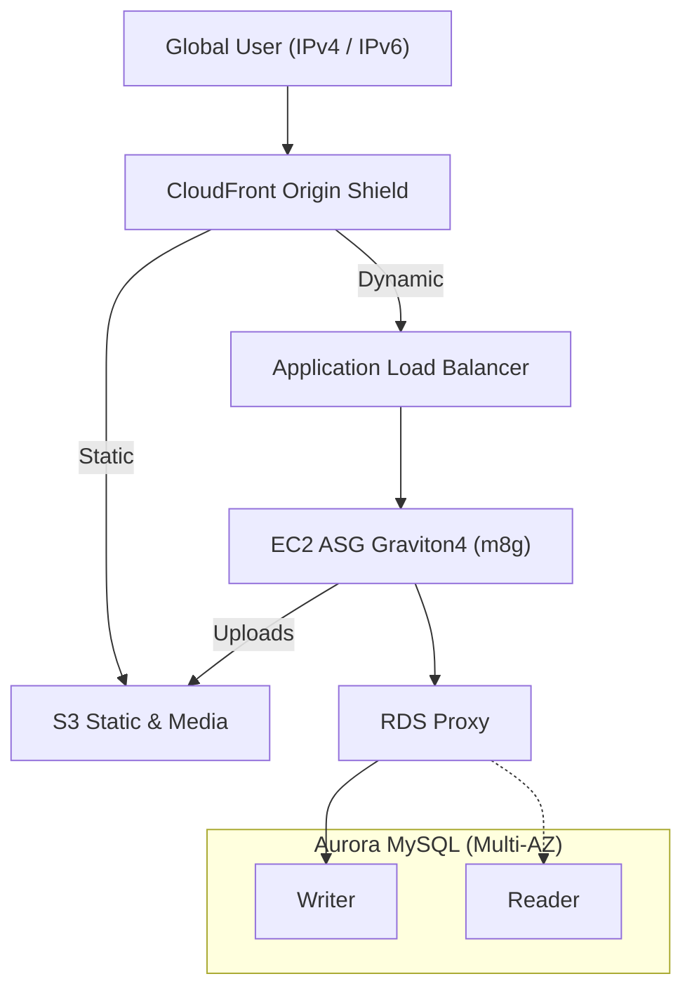
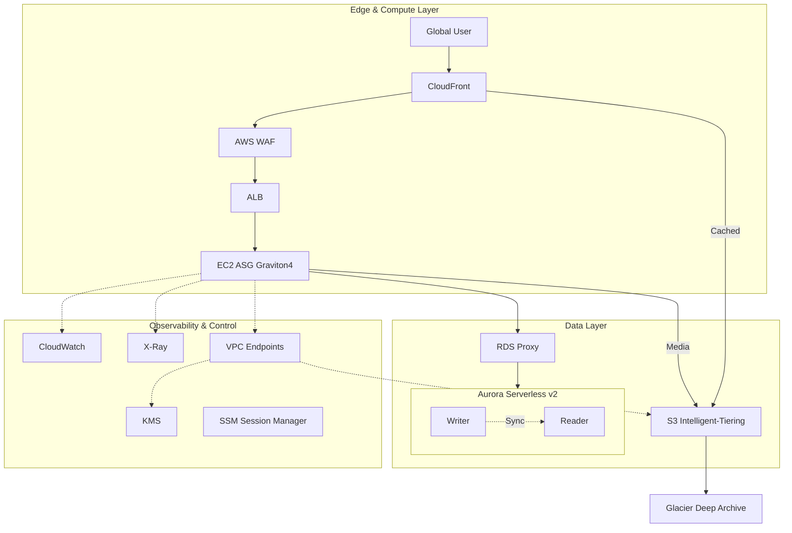

# Project 1: LAMP Stack Modernization & Cloud-Native Evolution

## 🌟 Executive Summary

This project demonstrates the modernization of a legacy **LAMP (Linux, Apache, MySQL, PHP)** monolith from an on-premises data center into a **production-grade AWS cloud-native architecture (2026-ready)**.

This is **not** a lift-and-shift exercise. The focus is on:

* IPv6-first cost governance
* Zero-trust & private connectivity
* Stateless compute and managed data tiers
* Architect-level tradeoff reasoning (SAP-C02 / ANS-C01 aligned)

---

## 🎗️ Architecture Evolution

### 1️⃣ Core Business Path — L1 (What Makes Money)

> This diagram shows **only the revenue-critical request path**
> Everything else (security, ops, governance) is intentionally hidden.

🛡️ **Production-Grade Details (L2 / L3 Deep Dive)**

<b>🚀 Click to Expand: Security, Observability & Governance</b>

This diagram exposes the **non-obvious enterprise layers** required for production readiness: private connectivity, encryption boundaries, and request-path observability.

---

## 💎 Technical Pillars (Interview-Grade Reasoning)

### 1️⃣ Advanced Networking (ANS-C01)

* **IPv6-first subnets** — Eliminates NAT Gateway dependency, avoids public IPv4 cost growth
* **PrivateLink (VPC Endpoints)** — S3 / KMS traffic never leaves AWS backbone, deterministic latency & security boundary

### 2️⃣ Compute & Cost Governance

* **Graviton4 (m8g)** — ~40% better price-performance for PHP-FPM
* **Stateless application tier** — All mutable state offloaded to S3 / Aurora; enables aggressive auto-scaling and recycling

### 3️⃣ Data Integrity & Resilience (SAP-C02)

* **RDS Proxy** — Absorbs PHP connection storms, smooth failovers
* **Aurora Serverless v2** — Scales with unpredictable traffic, reader ready for cross-region expansion
* **S3 Intelligent-Tiering** — Automatic lifecycle cost optimization

---

## 📊 Architecture Decision Records (ADR)

| Area     | Decision             | Reasoning                         |
| -------- | -------------------- | --------------------------------- |
| Compute  | EC2 Graviton4 ASG    | Predictable latency, PHP maturity |
| Database | Aurora Serverless v2 | Elastic scale, HA by default      |
| Security | WAF + PrivateLink    | Edge filtering + zero-trust       |
| Ops      | SSM (No SSH)         | No inbound management ports       |
| Storage  | S3 + CloudFront      | Stateless design                  |

---

## 🚀 Future Roadmap

* Infrastructure as Code (Terraform)
* Deep PHP tracing with X-Ray subsegments
* Migration path to **EKS on Fargate**
* Aurora Global Database (read expansion)

> **Positioning statement
