# Project 2: Mission-Critical Global Financial Clearing System

## 1. Overview
This project presents a high-availability, low-latency architecture designed for a global financial clearing platform. The system facilitates cross-border transactions between major financial hubs (e.g., London and Singapore), where **data integrity**, **regulatory compliance**, and **sub-second latency** are non-negotiable requirements.

The core challenge addressed here is the **"Speed of Light" constraint**: managing state consistency across a ~160ms round-trip time (RTT) while ensuring the system remains responsive to global trading nodes.

---

## 2. Architecture Diagram

```mermaid
flowchart TB

    %% =====================
    %% Global Users
    %% =====================
    subgraph Users ["🌍 Global Trading Clients"]
        direction TB
        U_LDN["London Clients"]
        U_SGP["Singapore Clients"]
    end

    %% =====================
    %% Global Entry
    %% =====================
    GA["AWS Global Accelerator<br/>(Anycast IP)"]

    U_LDN --> GA
    U_SGP --> GA

    %% =====================
    %% Primary Region
    %% =====================
    subgraph Region_LDN ["🇬🇧 Primary Region: London (eu-west-2)"]
        direction TB

        ALB_L["ALB"]
        ASG_L["Settlement Service<br/>(Active)"]
        DB_W[("Aurora Global DB<br/>Writer")]

        ALB_L --> ASG_L
        ASG_L --> DB_W
    end

    %% =====================
    %% Secondary Region
    %% =====================
    subgraph Region_SGP ["🇸🇬 Secondary Region: Singapore (ap-southeast-1)"]
        direction TB

        ALB_S["ALB"]
        ASG_S["Query Service<br/>(Read-Only)"]
        DB_R[("Aurora Global Replica")]

        ALB_S --> ASG_S
        ASG_S --> DB_R
    end

    %% =====================
    %% Traffic Routing
    %% =====================
    GA -->|Lowest Latency| ALB_L
    GA -->|Optimized Path| ALB_S

    %% =====================
    %% Global Sync & Control
    %% =====================
    DB_W ====>|Storage-level Replication < 1s| DB_R
    ASG_S -.->|Emergency Write / Failover| DB_W

    %% =====================
    %% Network Backbone
    %% =====================
    TGW_L["Transit Gateway<br/>London"]
    TGW_S["Transit Gateway<br/>Singapore"]

    TGW_L --- TGW_S

    %% =====================
    %% Styling
    %% =====================
    style DB_W fill:#e6f7ff,stroke:#1890ff,stroke-width:2px
    style DB_R fill:#fff7e6,stroke:#ffa940,stroke-width:2px
    style GA fill:#f9f0ff,stroke:#722ed1
```

---

## 3. The "Expert" Trade-offs 
A. Network Path Optimization: Global Accelerator vs. Route 53
Traditional Latency-based Routing (Route 53) is subject to public internet fluctuations and DNS caching issues.

Decision: Implemented AWS Global Accelerator.

Reasoning: By using Anycast static IPs, we terminate TCP connections at the AWS Edge. Traffic travels over the AWS Global Backbone, significantly reducing jitter and packet loss, which is critical for financial FIX protocol stability.

B. Database Consistency: Aurora Global Database
Synchronous replication over 10,000 km would cripple application performance due to the speed of light.

Decision: Utilized Aurora Global Database with storage-level asynchronous replication.

Reasoning: This keeps the global replication lag under 1 second, providing a near-zero RPO (Recovery Point Objective) disaster recovery plan without impacting the write latency of the primary settlement engine in London.

C. Write Strategy: Local-Read / Remote-Write
To maintain a single "Source of Truth" for clearing:

Strategy: All "Write" operations (Clearing/Settlement) are routed to London. "Read" operations (Reporting/Audit/Balance Checks) are served locally in Singapore.

Benefit: This avoids complex multi-master conflict resolution while providing the fastest possible experience for 80% of the traffic (which is read-heavy).

---
## 4. Summary of Business Outcomes
Global Reach: Sub-second data synchronization between Europe and Asia.

Reliability: 99.99% availability with automated Region-level failover capabilities.

Compliance: Data residency and encryption standards met for Tier-1 financial institutions.
